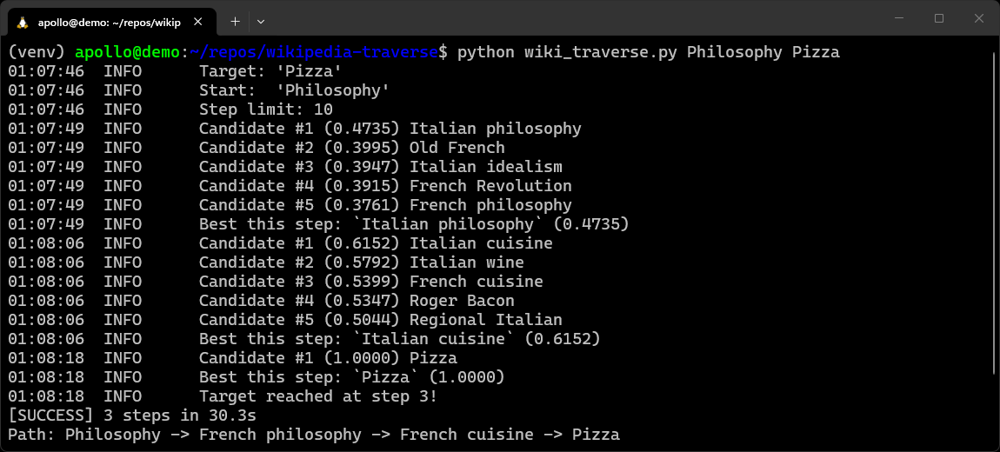

<a id="readme-top"></a>

[![Contributors][contributors-shield]][contributors-url]
[![Forks][forks-shield]][forks-url]
[![Stargazers][stars-shield]][stars-url]
[![Issues][issues-shield]][issues-url]
[![GPL-3.0 License][license-shield]][license-url]
[![LinkedIn][linkedin-shield]][linkedin-url]


<!-- PROJECT LOGO -->
<br />
<div align="center">
  <a href="https://github.com/RichardGabelman/wikipedia-traverse">
    
  </a>

<h3 align="center">Wikipedia Traverse</h3>

  <p align="center">
    An NLP-powered beam search Wikipedia traversal program.
    <br />
    <br />
    <!-- <a href="https://github.com/RichardGabelman/wikipedia-traverse">View Demo</a> --->
    <!-- &middot; --->
    <a href="https://github.com/RichardGabelman/wikipedia-traverse/issues/new?labels=bug&template=bug-report---.md">Report Bug</a>
    &middot;
    <a href="https://github.com/RichardGabelman/wikipedia-traverse/issues/new?labels=enhancement&template=feature-request---.md">Request Feature</a>
  </p>
</div>


<!-- TABLE OF CONTENTS -->
<details>
  <summary>Table of Contents</summary>
  <ol>
    <li>
      <a href="#about-the-project">About The Project</a>
      <ul>
        <li><a href="#built-with">Built With</a></li>
      </ul>
    </li>
    <li>
      <a href="#getting-started">Getting Started</a>
      <ul>
        <li><a href="#prerequisites">Prerequisites</a></li>
        <li><a href="#installation">Installation</a></li>
      </ul>
    </li>
    <li><a href="#usage">Usage</a></li>
    <li><a href="#roadmap">Roadmap</a></li>
    <li><a href="#contributing">Contributing</a></li>
    <li><a href="#license">License</a></li>
    <li><a href="#contact">Contact</a></li>
    <li><a href="#acknowledgments">Acknowledgments</a></li>
  </ol>
</details>


<!-- ABOUT THE PROJECT -->
## About The Project



<p>
Wikipedia Traverse navigates from any Wikipedia article to any other by following the links found on each page, using spaCy-powered semantic similarity to guide a beam search towards the target.
</p>
<p>
 It scores candidates by how semantically close their titles are to the destination, keeping only the most promising pages in the frontier at each step.
</p>
<p>
Once the target is found, it reconstructs and displays the full path of articles traversed to get there.
</p>

<p align="right">(<a href="#readme-top">back to top</a>)</p>


### Built With

* [![Python][Python.org]][Python-url]
* [![spaCy][spaCy.io]][spaCy-url]
* [![Wikipedia][Wikipedia.org]][Wikipedia-url]

<p align="right">(<a href="#readme-top">back to top</a>)</p>


<!-- GETTING STARTED -->
## Getting Started

To get a local copy up and running follow these simple steps.

### Prerequisites

This is an example of how to list things you need to use the software and how to install them.
* Python 3.8 or higher
* pip (Python package manager)

### Installation

1. Clone the repository:
   ```bash
   git clone https://github.com/RichardGabelman/wikipedia-traverse.git
   cd wiki-traversal
   ```
2. Create and activate a virtual environment:
   ```bash
   python3 -m venv venv
   source venv/bin/activate
   ```
3. Install dependencies:
   ```bash
   pip install -r requirements.txt
   ```

<p align="right">(<a href="#readme-top">back to top</a>)</p>


<!-- USAGE EXAMPLES -->
## Usage

Basic usage with article titles:
```bash
python wiki_traverse.py Philosophy Pizza
```

Using full URLs:
```bash
python wiki_traverse.py https://en.wikipedia.org/wiki/Big_Bang https://en.wikipedia.org/wiki/Athenian_democracy
```

With options:
```bash
python wiki_traverse.py Mathematics Basketball --steps 20 --beam-width 10
```

Default `steps` and `beam-width` values are 10 and 5 respectively.


<p align="right">(<a href="#readme-top">back to top</a>)</p>


<!-- LICENSE -->
## License

Distributed under the GPL-3.0 License. See `LICENSE.txt` for more information.

<p align="right">(<a href="#readme-top">back to top</a>)</p>


<!-- CONTACT -->
## Contact

Richard Gabelman - [@RichardGabelman](https://twitter.com/RichardGabelman) - richardgabelman@gmail.com

Project Link: [https://github.com/RichardGabelman/wikipedia-traverse](https://github.com/RichardGabelman/wikipedia-traverse)

<p align="right">(<a href="#readme-top">back to top</a>)</p>


<!-- ACKNOWLEDGMENTS -->
## Acknowledgments

* [spaCy](https://spacy.io/) for NLP and semantic similarity capabilities
* [Beautiful Soup](https://www.crummy.com/software/BeautifulSoup/) for HTML parsing
* Wikipedia for providing free access to their content and APIs

<p align="right">(<a href="#readme-top">back to top</a>)</p>


<!-- MARKDOWN LINKS & IMAGES -->
<!-- https://www.markdownguide.org/basic-syntax/#reference-style-links -->
[contributors-shield]: https://img.shields.io/github/contributors/RichardGabelman/wikipedia-traverse.svg?style=for-the-badge
[contributors-url]: https://github.com/RichardGabelman/wikipedia-traverse/graphs/contributors
[forks-shield]: https://img.shields.io/github/forks/RichardGabelman/wikipedia-traverse.svg?style=for-the-badge
[forks-url]: https://github.com/RichardGabelman/wikipedia-traverse/network/members
[stars-shield]: https://img.shields.io/github/stars/RichardGabelman/wikipedia-traverse.svg?style=for-the-badge
[stars-url]: https://github.com/RichardGabelman/wikipedia-traverse/stargazers
[issues-shield]: https://img.shields.io/github/issues/RichardGabelman/wikipedia-traverse.svg?style=for-the-badge
[issues-url]: https://github.com/RichardGabelman/wikipedia-traverse/issues
[license-shield]: https://img.shields.io/github/license/RichardGabelman/wikipedia-traverse.svg?style=for-the-badge
[license-url]: https://github.com/RichardGabelman/wikipedia-traverse/blob/master/LICENSE.txt
[linkedin-shield]: https://img.shields.io/badge/-LinkedIn-black.svg?style=for-the-badge&logo=linkedin&colorB=555
[linkedin-url]: https://linkedin.com/in/richard-gabelman
[product-screenshot]: images/screenshot.png
<!-- Shields.io badges. You can a comprehensive list with many more badges at: https://github.com/inttter/md-badges -->
[Python.org]: https://img.shields.io/badge/Python-white?style=for-the-badge&logo=Python&logoColor=white&logoSize=auto&color=3776AB
[Python-url]: https://www.python.org
[Wikipedia.org]: https://img.shields.io/badge/Wikipedia-%23000000.svg?style=for-the-badge&logo=wikipedia&logoColor=white
[Wikipedia-url]: https://www.wikipedia.org
[spaCy.io]: https://img.shields.io/badge/spaCy-white?style=for-the-badge&logo=spacy&logoColor=white&logoSize=auto&color=077FA6
[spaCy-url]: https://spacy.io